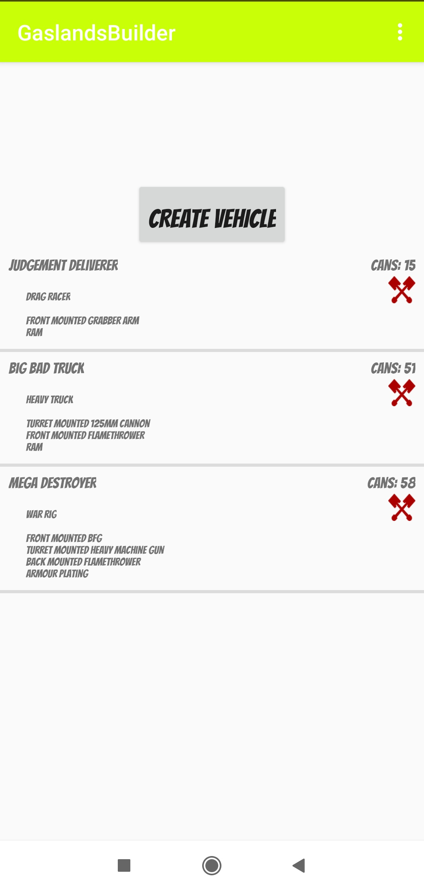
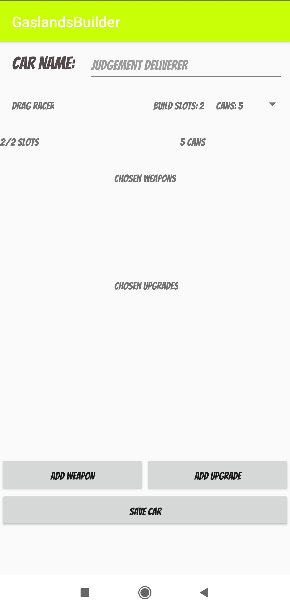
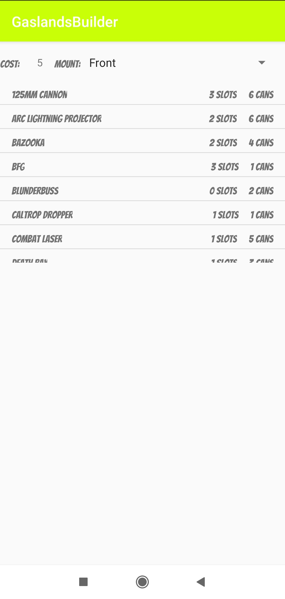

# GaslandsBuilder
Gaslands vehicle builder. This is my learning Android development app.

## Gaslands
Gaslands is a tabletop game where one plays with toy cars. For more information head to Gaslands site [here](https://gaslands.com/).

## Installation
You may download the app from Google Play but since it is beta version it must be entered via [this link from Android device](https://play.google.com/store/apps/details?id=com.bartek.gaslandsbuilder).

If you would like to install the app via usb then [click here](https://github.com/BartlomiejF/GaslandsBuilder/raw/master/app/release/app-release.apk)

## Features
The app has basic functionality - the user may create a car by choosing its type, add weapons and upgrades. The overall vehicle cost and build slots is calculated. The user may save the car and view it on main screen.

## Others
If you would like to download prepopulated database with Gaslands weapons, upgrades and vehicles from this repository then [head here](https://github.com/BartlomiejF/GaslandsBuilder/raw/master/app/src/main/assets/databases/gaslandsWeapons.sqlite3). If it helped to reduce the amount of time it would take to populate the database on your own then give this repo a star.

## Screens
### Main view

### Create Vehicle

### Add Weapon

## Support
If you would like to show me support you may watch or star this project. You may also buy me a cup of coffee.

