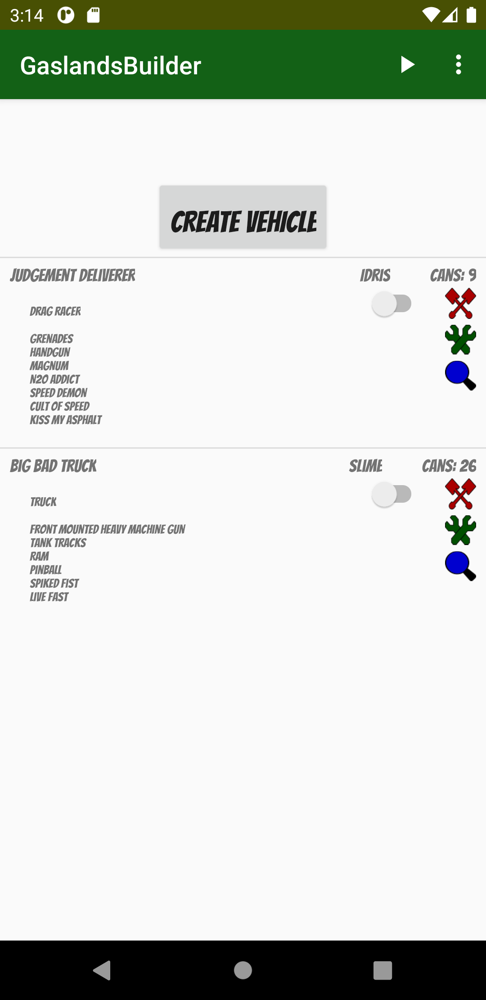
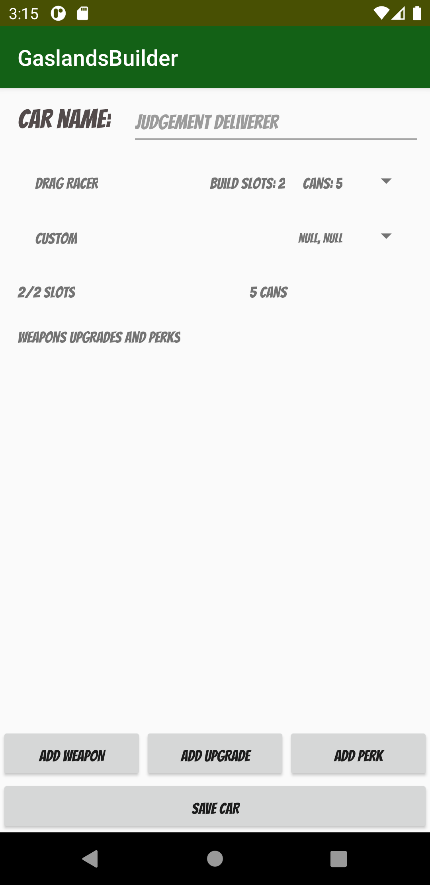
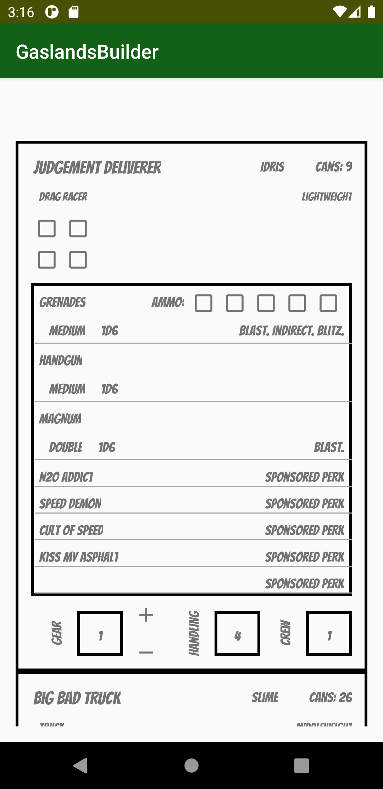

# GaslandsBuilder   
Gaslands vehicle builder.

## Gaslands
Gaslands is a tabletop game designed by Mike Hutchinson where one plays with toy cars. For more information head to Gaslands website [here](https://gaslands.com/). If you would like to ask some questions about the game head to [Facebbok](https://www.facebook.com/groups/gaslands)

## Installation
You may download the app from [Google Play](https://play.google.com/store/apps/details?id=com.bartek.gaslandsbuilder).

If you would like to install the app via usb then [click here](https://github.com/BartlomiejF/GaslandsBuilder/blob/master/app/release/current.apk) to download the apk.

## Features
The app has basic functionality - the user may create a car by choosing its type, add weapons, upgrades, perks and choose sponsor. The overall vehicle cost and build slots is calculated. The user may save the car, view it on main screen. There is also game tracker feature - you choose saved cars that you field in the game and then open game tracker to track its hull points, gear etc.

## Others
If you would like to download prepopulated database with Gaslands weapons, upgrades and vehicles from this repository then [head here](https://github.com/BartlomiejF/GaslandsBuilder/raw/master/app/src/main/assets/databases/gaslandsWeapons.sqlite3). If it helped to reduce the amount of time it would take to populate the database on your own then give this repo a star.

## Screens
| Main view  | Create Vehicle |  Track your game |
|---|---|---|
|   |   |   |

## Support
If you would like to show me support you may watch or star this project.
